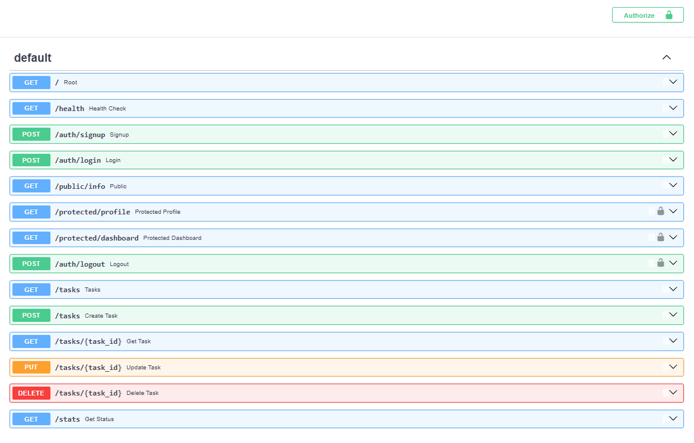

# FlyRank Backend Track - Auth · Login & protect

## Project Overview
This project is a secure backend API built with FastAPI and Supabase, completed as part of the FlyRank Internship Backend Track. It demonstrates a complete authentication flow—including user registration, login, and logout—alongside custom middleware to guard protected routes using JSON Web Token (JWT) verification. 

## Environment Setup
Because this project is containerized using a multi-stage Docker build, setup is completely streamlined. A local PostgreSQL database and Redis instance are automatically provisioned and networked for you.

1. Clone this repository.
2. Create a file named `.env` in the root directory.
3. Copy the variables from `.env.example` into your new `.env` file and fill in your real Supabase API keys:

```ini
SUPABASE_URL=your_project_url
SUPABASE_KEY=your_anon_key
PORT=8000
```

## How to Run the Server
With Docker installed, you can start the entire stack with a single command:

```bash
docker compose up --build
```
The server will start and be accessible at `http://localhost:8000`.

## API Endpoint Reference

| Route | Method | Purpose | Auth Header Required? |
| :--- | :---: | :--- | :---: |
| `/auth/signup` | POST | Creates a new user account in Supabase. | No |
| `/auth/login` | POST | Authenticates credentials and returns a JWT. | No |
| `/public/info` | GET | An open endpoint returning public data. | No |
| `/protected/profile` | GET | Returns the authenticated user's ID and email. | Yes (Bearer `<token>`) |
| `/protected/dashboard`| GET | A secure dashboard welcoming the user. | Yes (Bearer `<token>`) |
| `/auth/logout` | POST | Destroys the user's active session. | Yes (Bearer `<token>`) |

## Interactive Swagger UI Documentation
FastAPI automatically generates interactive API documentation. You can access it by navigating to `http://localhost:8000/docs` while the containers are running. The protected routes are secured using the `HTTPBearer` scheme, allowing you to test the locked doors directly from the browser.



## Read The Token Yourself
A JWT contains a readable payload of 'claims' about a user, such as their unique ID, email, and session expiration timestamp. You should never store sensitive secrets inside a JWT because the payload is merely encoded, not encrypted, meaning anyone who gets their hands on the token can easily read its contents.

## The expiry experiment
Access tokens are deliberately short-lived so that if one is stolen, the attacker only has a very brief window to use it, once it expires, the application uses a secure, long-lived refresh token behind the scenes to obtain a new access token without forcing the user to re-enter their password.

## A 403 case (401 vs 403)
A 401 Unauthorized error means the server doesn't know who you are, whereas a 403 Forbidden error means the server knows exactly who you are, but you do not have the required permission level to access that specific resource.

## A Real logout Test
Because JWTs are stateless and verified cryptographically rather than against a database, instant logout is inherently difficult; a server cannot reach into a client's browser to destroy an existing token, meaning the token remains technically valid until it naturally expires even after the server has destroyed the session.

## Refresh flow
Added a /auth/refresh endpoint to handle session continuation. Access tokens are deliberately short-lived to minimize the security window if a token is stolen; this refresh endpoint allows the frontend to securely exchange a long-lived refresh token for a fresh access token without interrupting the user's experience by forcing them to log in again.

## Rate Limiting
Brute-force protection and rate-limiting specifically live on the POST /auth/login endpoint because it is the primary public gateway where attackers can attempt dictionary attacks to guess passwords. By returning a 429 Too Many Requests status after too many failed attempts, the server financially and temporally bankrupts automated attacks before they can breach an account.